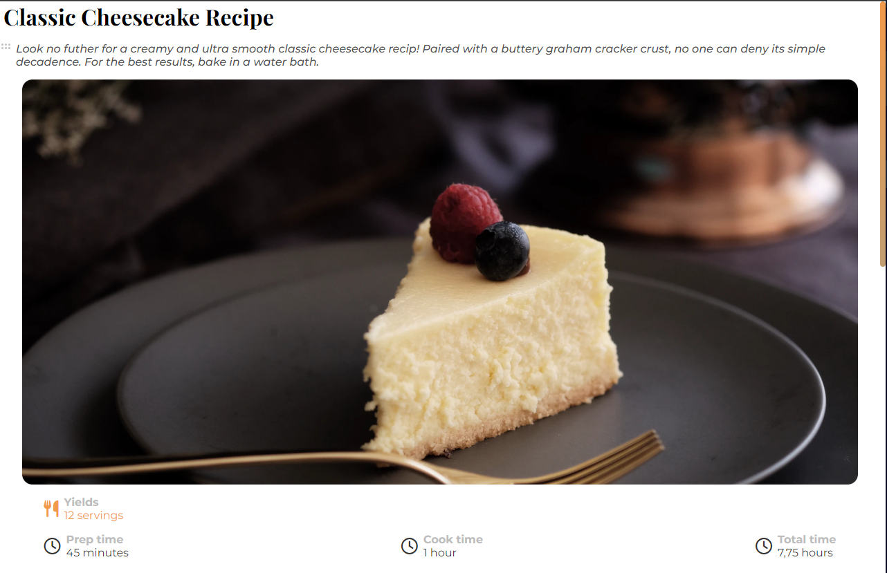

<h1 align="center">Recipe page</h1>

   Solution for a challenge from  <a href="http://devchallenges.io" target="_blank">Devchallenges.io</a>.

  <h3>
    <a href="https://abisol-2711.github.io/Day97/">
      Demo
    </a>
     | 
    <a href="https://github.com/Abisol-2711/Day97">
      Solution
    </a>
     | 
    <a href="https://devchallenges.io/challenges/OEKdUZ6xs0h99C38XVht">
      Challenge
    </a>
  </h3>

<!-- TABLE OF CONTENTS -->

## Table of Contents

- [Overview](#overview)
  - [Built With](#built-with)
- [Features](#features)
- [Contact](#contact)
- [Acknowledgements](#acknowledgements)

<!-- OVERVIEW -->

## Overview

Recipe page

### Built With

<!-- This section should list any major frameworks that you built your project using. Here are a few examples.-->

- [Html](https://developer.mozilla.org/es/docs/Web/HTML)
- [Css](https://developer.mozilla.org/es/docs/Web/CSS)

## Features

<!-- List the features of your application or follow the template. Don't share the figma file here :) -->

This application/site was created as a submission to a [DevChallenges](https://devchallenges.io/challenges) challenge. The [challenge](https://devchallenges.io/challenges/hhmesazsqgKXrTkYkt0U) was to build an application to complete the given user stories.

## Acknowledgements

<!-- This section should list any articles or add-ons/plugins that helps you to complete the project. This is optional but it will help you in the future. For exmpale -->

- [Steps to replicate a design with only HTML and CSS](https://devchallenges-blogs.web.app/how-to-replicate-design/)

## Contact

- [Linkedin](https://www.linkedin.com/in/sol-r%C3%A1zuri-fullstackdeveloper/)
- [GitHub](https://github.com/Abisol-2711)
